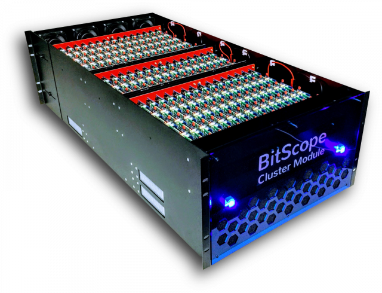

# Introduction 

Welcome to the ELL PiClusterService.  This is a simple Node.js web application that runs in Azure providing
a simple way to manage a list of raspberry pi machines that are being used for testing.

This service provides a central place for the machines to register themselves when they reboot and for
remote jobs to "lock" and "unlock" those machines to coordinate the usage of them so different test
runs don't clobber each other.

The node.js service runs in memory so it is quick, but has limited scalability as a result.
You can also integrate this with an Azure Dev Ops Build configuration to automate testing of your
code on a raspberry pi cluster.

See also [http://cluster.bitscope.com/](http://cluster.bitscope.com/)


## Installation

Install [Node.js](https://nodejs.org/en/).

For local testing all you need to do is run `npm install`.

Set the following environment variables:

| Varaible       | Value                                       |
|----------------|---------------------------------------------|
| `RPI_CLUSTER`  | The URL of the cluster                      |
| `RPI_APIKEY`   | The API key to use                          |
| `RPI_PASSWORD` | The login password for the cluster machines |

For local testing you can set RPI_CLUSTER to `http://localhost:1337/`

Then simply load the folder into [Visual Studio Code](https://code.visualstudio.com/), load index.js and edit the string  `<replace_this_with_your_api_key>` and replace it with your own
unique GUID, keep this secret.

Then press F5.  You should see this message:
```
Server running at http://localhost:1337
```

So point your web browser at this address to see the result.

You can also use `npm start` from the command line.

## Hosting in Azure

See [Node.js App Service Getting Started](https://docs.microsoft.com/en-us/azure/app-service/app-service-web-get-started-nodejs), to create your Node.js Azure Web App (but ignore all the steps about deploying with Zip).  You will be deploying using git.

Once you follow all these steps you should have a service URL which should look
something like this: `<app_name>.azurewebsites.net`.  Replace all instances of
`<app_name>.azurewebsites.net` you see below with your service URL.

Once your service is running you can choose how you want to deploy your updated bits.
See [App Service Deployment](https://docs.microsoft.com/en-us/azure/app-service/).

If you use Github deployment then pushing new bits is this simple:

```
git push azure master
```

Now you can also set your RPI_CLUSTER environment to point to your new
service, see that you append "/api/" to the end of that URL, and yes that final "/" is important.

| Varaible       | Value                                       |
|----------------|---------------------------------------------|
| `RPI_CLUSTER`  | `<app_name>.azurewebsites.net/api/`         |


## Adding a Raspberry Pi

Follow the instrutions at [ELL-PiDataCenter](https://github.com/Microsoft/ELL-PiDataCenter/tree/master/PiDataCenter)
which show how to setup a Raspberry Pi machine so that it automatically registers itself with this service.

## Using the Service

You can also use the service manually by running these two scripts:
* `list.py` to list all available machines and see their status.
* `lock.py ipaddress` to lock a machine listed as free on the website.
* `unlock.py ipaddress` to unlock the machine when you are finished.

This is handy if you want to login using SSH and do long running work on a given machine, perhaps you need to install some new stuff and so on.

But if you want to automate a short job you can import `picluster.py` into your app and do the following:

```python
import picluster
cluster = picluster.PiBoardTable("<app_name>.azurewebsites.net/api/")
machine = self.cluster.wait_for_free_machine("some descriptive job name")
```
This will wait until a machine becomes available, lock it for your job, then you can do what drivetest does to send the job to the machine using SCP and SSH libraries.  When the job is finished run this:

```python
cluster.unlock(machine.ip_address)
```

This is picking up your user name as well and it ensures you are the only one that can free this machine that you locked.
It is convenient to see who has locked the machine anyway, in case we need to follow up with that person to see if they are done
in the event that something goes wrong and they accidentally forgot to free the machine.

## Example Usage

The [pitest](https://github.com/Microsoft/ELL/tree/master/tools/utilities/pitest)folder in the ELL repo shows how to create a fully automated test that uses this cluster service to get a free raspberry pi, then use SSH and SCP to copy bits over to that machine and run tests on it, get the results back, then unlock the machine.


# Contributing

This project welcomes contributions and suggestions.  Most contributions require you to agree to a
Contributor License Agreement (CLA) declaring that you have the right to, and actually do, grant us
the rights to use your contribution. For details, visit https://cla.microsoft.com.

When you submit a pull request, a CLA-bot will automatically determine whether you need to provide
a CLA and decorate the PR appropriately (e.g., label, comment). Simply follow the instructions
provided by the bot. You will only need to do this once across all repos using our CLA.

This project has adopted the [Microsoft Open Source Code of Conduct](https://opensource.microsoft.com/codeofconduct/).
For more information see the [Code of Conduct FAQ](https://opensource.microsoft.com/codeofconduct/faq/) or
contact [opencode@microsoft.com](mailto:opencode@microsoft.com) with any additional questions or comments.
